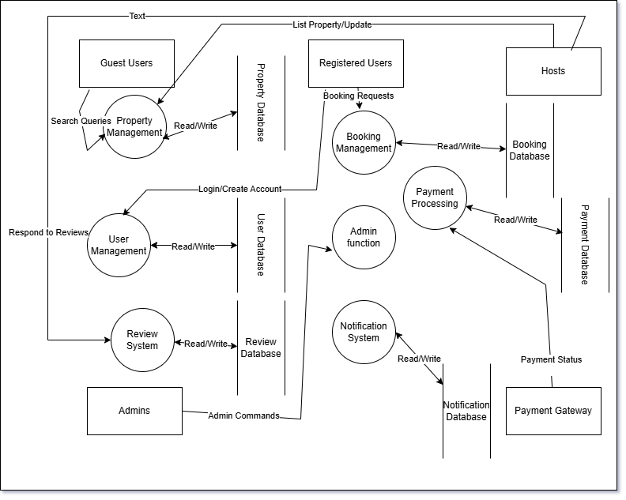

# Airbnb Clone - Data Flow Diagram

This document presents the Data Flow Diagram (DFD) for the Airbnb Clone backend system, illustrating how data moves through the system.

## Overview

The Data Flow Diagram visualizes the movement of data between external entities, processes, and data stores within the Airbnb Clone system. This diagram helps understand the system's data processing from a functional perspective without focusing on implementation details.

## Components

The DFD includes the following components:

### External Entities

* **Guests** - Unregistered users browsing the platform
* **Registered Users** - Users with accounts who can book properties
* **Hosts** - Users who list and manage properties
* **Admins** - System administrators
* **Payment Gateway** - External payment processing service

### Processes

1. **User Management**
   * Registration
   * Authentication
   * Profile Management
2. **Property Management**
   * Listing Creation
   * Listing Update
   * Listing Search
3. **Booking Management**
   * Booking Creation
   * Booking Update
   * Availability Checking
4. **Payment Processing**
   * Payment Authorization
   * Fund Transfer
   * Refund Processing
5. **Review System**
   * Review Submission
   * Review Display
   * Response Management
6. **Notification System**
   * Email Notifications
   * In-App Notifications
7. **Administrative Functions**
   * User Oversight
   * Content Moderation
   * System Configuration

### Data Stores

1. **User Database**
   * User profiles and credentials
   * User preferences and settings
2. **Property Database**
   * Property details and photos
   * Pricing and availability
3. **Booking Database**
   * Booking details
   * Booking status
4. **Payment Database**
   * Transaction records
   * Payment status
5. **Review Database**
   * User reviews
   * Host responses
6. **Notification Database**
   * Notification templates
   * Notification history

### Data Flows

The arrows in the diagram represent data flows between components. Key data flows include:

* User registration data
* Authentication credentials
* Property listing information
* Search queries and results
* Booking requests and confirmations
* Payment information
* Review content
* Notification messages
* Administrative commands

## Visual Representation

## How to Use This Diagram

This Data Flow Diagram serves as a reference for:

1. Understanding how data moves through the system
2. Identifying key processes and data stores needed
3. Planning database schema design
4. Developing API endpoints
5. Implementing data validation rules

## Levels of Detail

This DFD represents a context-level (Level 0) view of the system. For more detailed analysis, individual processes can be expanded into separate Level 1 DFDs.
