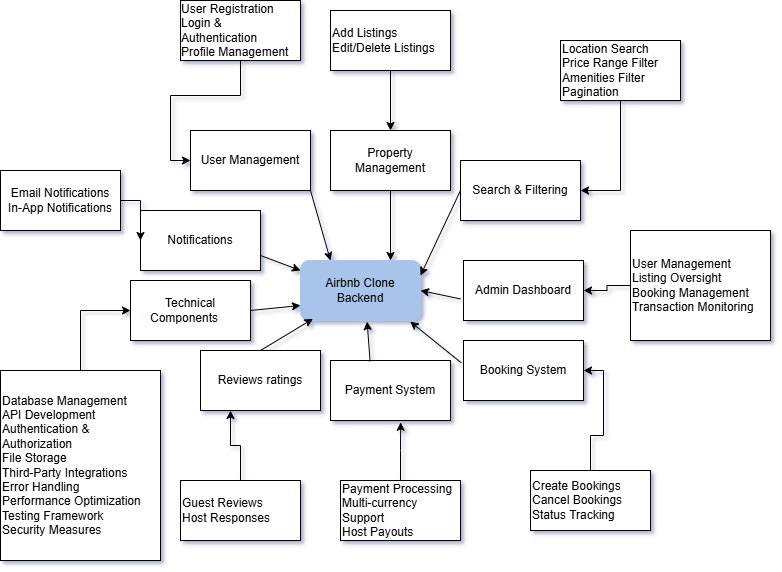

# Airbnb Clone Backend - Features and Functionalities Documentation

This document provides a comprehensive overview of the features and functionalities required for the Airbnb Clone backend system.

## Core Functionalities

### 1. User Management
- **User Registration**
  - Sign up as guests or hosts
  - Secure authentication via JWT
  
- **User Login and Authentication**
  - Login via email and password
  - OAuth options (Google, Facebook)
  
- **Profile Management**
  - Update user profiles
  - Manage profile photos
  - Update contact information and preferences

### 2. Property Listings Management
- **Add Listings**
  - Create property listings with details:
    - Title and description
    - Location
    - Price
    - Amenities
    - Availability calendar
    
- **Edit/Delete Listings**
  - Update property information
  - Remove listings from the platform

### 3. Search and Filtering
- **Search Functionality**
  - Find properties by:
    - Location
    - Price range
    - Number of guests
    - Amenities (Wi-Fi, pool, pet-friendly, etc.)
  - Pagination for large result sets

### 4. Booking Management
- **Booking Creation**
  - Book properties for specific dates
  - Date validation to prevent double bookings
  
- **Booking Cancellation**
  - Cancel bookings based on defined policies
  
- **Booking Status Tracking**
  - Monitor status: pending, confirmed, canceled, completed

### 5. Payment Integration
- **Secure Payment Processing**
  - Integration with payment gateways (Stripe, PayPal)
  - Upfront payments from guests
  - Automatic payouts to hosts
  - Multi-currency support

### 6. Reviews and Ratings
- **Guest Reviews**
  - Leave reviews and ratings for properties
  
- **Host Responses**
  - Allow hosts to respond to reviews
  
- **Verified Reviews**
  - Link reviews to completed bookings to prevent abuse

### 7. Notifications System
- **Email Notifications**
  - Booking confirmations
  - Cancellations
  - Payment updates
  
- **In-App Notifications**
  - Real-time updates on platform activities

### 8. Admin Dashboard
- **Administrative Controls**
  - Monitor and manage users
  - Oversee property listings
  - Track bookings
  - Manage payment transactions

## Technical Requirements

### 1. Database Management
- Relational database (PostgreSQL/MySQL)
- Core tables: Users, Properties, Bookings, Reviews, Payments

### 2. API Development
- RESTful API architecture
- Appropriate HTTP methods and status codes
- Optional GraphQL implementation for complex data fetching

### 3. Authentication and Authorization
- JWT for secure sessions
- Role-based access control (guests, hosts, admins)

### 4. File Storage
- Cloud storage for property images and user profiles

### 5. Third-Party Services
- Email services for notifications

### 6. Error Handling and Logging
- Global error handling for APIs
- Comprehensive logging system

## Non-Functional Requirements

### 1. Scalability
- Modular architecture
- Horizontal scaling capability

### 2. Security
- Data encryption
- Firewalls and rate limiting

### 3. Performance Optimization
- Caching mechanisms
- Optimized database queries

### 4. Testing
- Unit and integration testing
- Automated API testing

## Visual Representation
