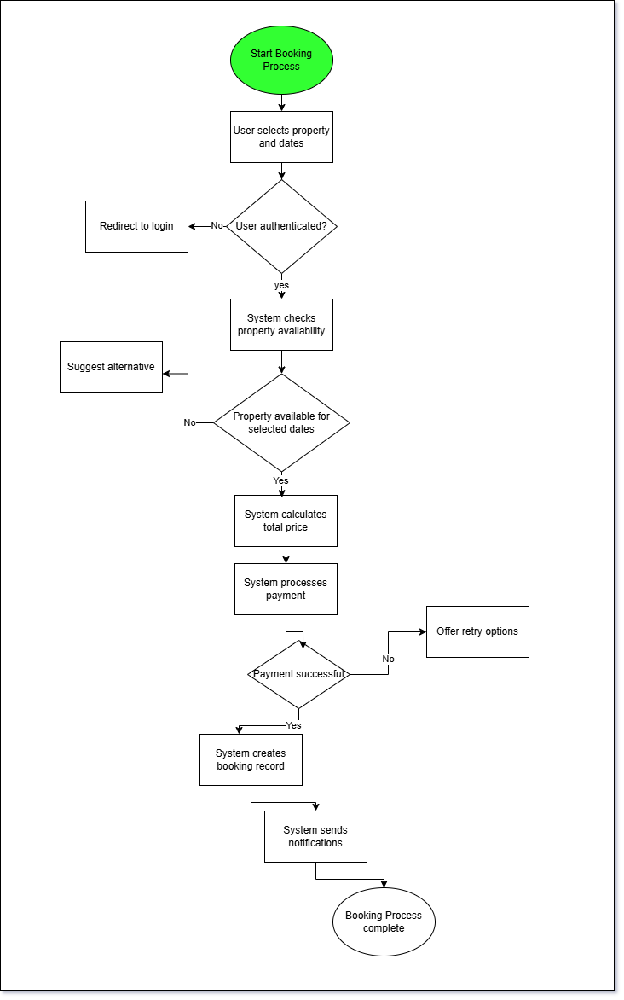

# Airbnb Clone - Process Flowchart

This document presents a detailed flowchart for the Property Booking process within the Airbnb Clone backend system.

## Overview

The flowchart visualizes the step-by-step workflow of the property booking process, including data validation, availability checking, payment processing, and notification generation.

## Process Description: Property Booking

The Property Booking process is one of the core functions of the Airbnb Clone platform. It involves multiple subsystems and requires careful coordination to ensure successful bookings while preventing conflicts.

### Process Steps

1. **Initiate Booking Request**
   * User selects property and desired dates
   * System captures booking details
2. **Validate Booking Data**
   * Verify user is authenticated
   * Check if dates and guest count are valid
3. **Check Property Availability**
   * Query database for current availability
   * Verify no conflicting bookings exist
   * Temporarily lock dates to prevent double-booking
4. **Calculate Total Price**
   * Apply base nightly rate
   * Add cleaning fee
   * Calculate service fee
   * Apply any applicable discounts
5. **Process Payment**
   * Collect payment details
   * Send to payment gateway
   * Verify payment success
   * Record transaction
6. **Create Booking Record**
   * Store booking details in database
   * Update property availability calendar
   * Release temporary lock
7. **Generate Confirmations**
   * Create booking confirmation for guest
   * Send notification to property host
   * Update user booking history
8. **Handle Exceptions**
   * If availability check fails: notify user and suggest alternatives
   * If payment fails: notify user and provide retry options
   * If system error occurs: log error and notify administrators

## Visual Representation

## How to Use This Flowchart

This flowchart serves as a reference for:

1. Backend developers implementing the booking system
2. QA engineers designing test scenarios
3. Product managers understanding the booking workflow
4. Documentation writers creating user guides

## Related Processes

This flowchart focuses on the booking creation process. Related processes include:

* Booking cancellation flow
* Booking modification flow
* Payment refund flow
