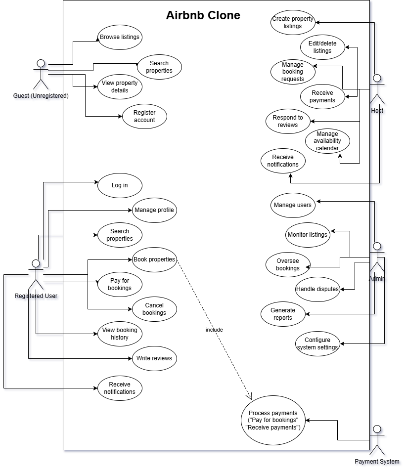

# Airbnb Clone - Use Case Diagram

This document presents the Use Case Diagram for the Airbnb Clone backend system, illustrating how different actors interact with the system's key functionalities.

## Overview

The Use Case Diagram visualizes the interactions between the system's primary actors and the core functionalities identified in our feature documentation. This diagram helps understand the system from the users' perspective and clarifies how different user types engage with the platform.

## Actors

The system involves the following actors:

1. **Guest (Unregistered User)** - Users who browse the platform without logging in
2. **Registered User** - Users who have created an account and can book properties
3. **Host** - Users who list and manage properties
4. **Admin** - System administrators who manage the platform
5. **Payment System** - External payment processing service

## Use Cases

The diagram illustrates the following key use cases:

### Guest Use Cases

* Browse listings
* Search properties
* View property details
* Register account

### Registered User Use Cases

* Log in
* Manage profile
* Search properties
* Book properties
* Pay for bookings
* Cancel bookings
* View booking history
* Write reviews
* Receive notifications

### Host Use Cases

* Create property listings
* Edit/delete listings
* Manage booking requests
* Receive payments
* Respond to reviews
* Manage availability calendar
* Receive notifications

### Admin Use Cases

* Manage users
* Monitor listings
* Oversee bookings
* Handle disputes
* Generate reports
* Configure system settings

## Relationships

The diagram also shows relationships between use cases, including:

* **Include relationships** - When one use case always includes the behavior of another
* **Extend relationships** - When one use case conditionally extends another

## Visual Representation

## How to Use This Diagram

This Use Case Diagram serves as a reference for:

1. Understanding the system's scope
2. Identifying major functional requirements
3. Communicating with stakeholders about system capabilities
4. Guiding further requirements and development activities
